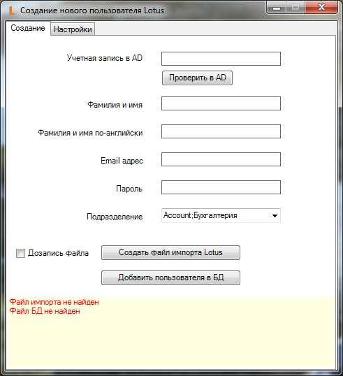

# LotusNewUser

Script for generating CSV import file

Generated file can be imported in Lotus Domino Administrator to register new user 

File format documentation source:

https://www.ibm.com/support/knowledgecenter/en/SSKTMJ_8.0.1/com.ibm.help.domino.admin.doc/DOC/H_ID_INFORMATION.html

Example content of file: 

Alexis;Catherine;;;password1;;;Marketing / Acme;;;;;;Marketing Profile 

#### Requirements: Powershell 2.0; Remote Server Administration Tools for retrieving data from AD 
#### Kosarev Albert, 2016
